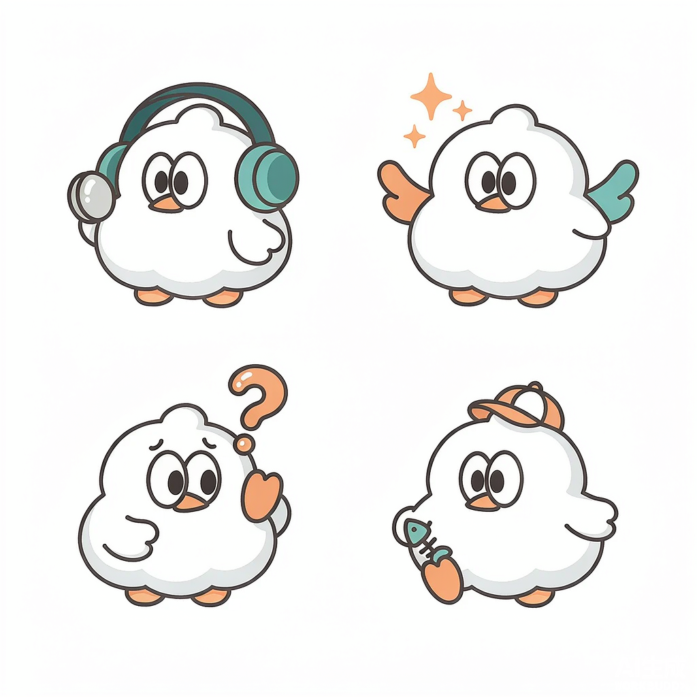
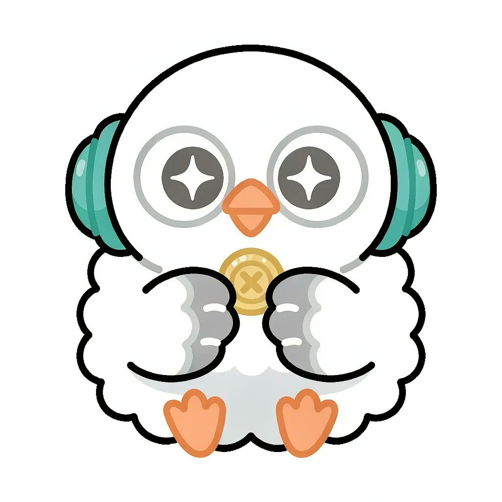
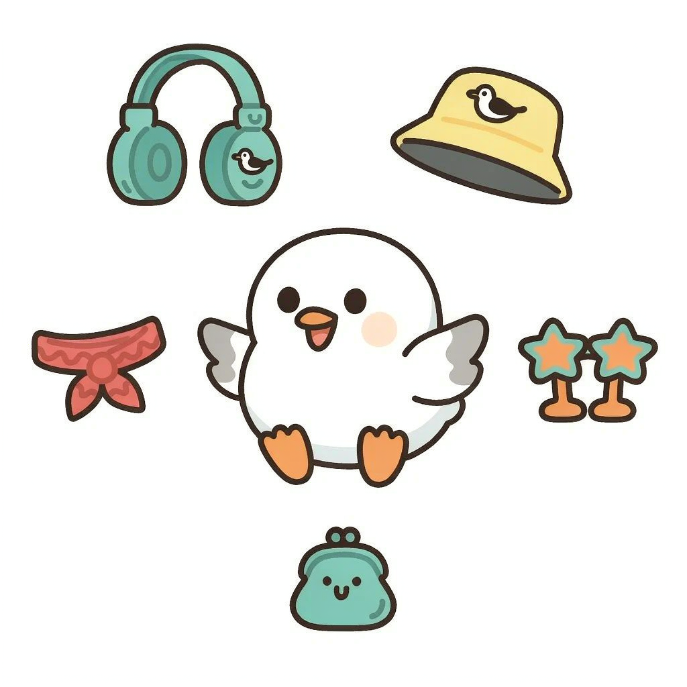
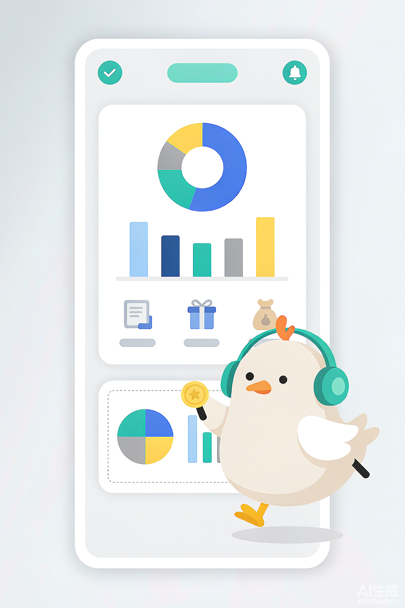

# 小鸥全新形象设计任务书

> 项目：鸥算AI · 智能消费管家  
> 目标：为吉祥物「小鸥」设计全新 IP 形象（参考「山团团」风格），支持在 App 界面出现、可拖拽、可换装  
> 当前状态：仅出方案与任务书，待方案确认后再进入代码修改

---

## 1. 项目背景与现状

### 1.1 软件现状
- **Android 端**：Kotlin + 传统 Activity/Fragment + View Binding，已存在 `MascotManager` 单例管理当前形象。
- **现有吉祥物**：当前为 4 张独立 PNG（`ic_mascot.png`、`ic_mascot_happy.png`、`ic_mascot_alert.png`、`ic_mascot_hat.png`），通过 `MascotManager.Mascot` 枚举整体切换。
- **现有能力**：
  - 已支持「我的 → 小鸥换装」入口切换 4 个完整形象。
  - 已预留 `MascotSkin` 装扮枚举，但仅 `NONE` 一种，未实现分层叠加。
  - 各页面使用 `ImageView` 静态展示，**暂不支持拖拽与自由定位**。

### 1.2 本次目标
将「小鸥」从「静态图切换」升级为「可互动的桌面/悬浮伙伴」：
1. **出现在界面**：可在首页、记账页等关键页面以悬浮窗/覆盖层形式出现。
2. **可拖拽**：用户可长按并拖动小鸥到屏幕任意位置，位置持久化。
3. **可换装**：将形象拆分为「身体 + 表情 + 配饰」多层，支持自由组合换装。
4. **风格刷新**：参考「山团团」圆润团子风格，重塑小鸥视觉形象。

---

## 2. 参考分析：山团团风格提炼

参考图片呈现一群高度统一的圆形团子角色，可提炼以下设计语言：

| 维度 | 山团团特征 | 对小鸥的借鉴 |
|---|---|---|
| **轮廓** | 极度圆润的球形/椭圆主体，几乎无棱角 | 小鸥主体为「白胖海鸥团子」，翅膀、脚均为圆润短粗形 |
| **比例** | 大头小身、大眼小嘴，头身比约 1:1 ~ 1:1.2 | 小鸥保持 1:1 团子比例，眼睛占面部 1/3 |
| **线条** | 粗黑外轮廓线，内部色块平涂 | 采用 3~4dp 粗描边矢量风格，适配 Android Vector Drawable |
| **配色** | 柔和马卡龙/莫兰迪色系，主色 ≤3 色 | 主色：海鸥白 + 海鸥青绿；辅色：暖橙（嘴/脚）；点缀： coin 金黄、耳机青绿 |
| **表情** | 夸张情绪符号化（星星眼、> < 眼、汗滴） | 设计 6~8 个表情符号化 face layer |
| **装饰** | 耳机、蝴蝶结、帽子等可拆卸小配件 | 建立配饰库：耳机、渔夫帽、围巾、墨镜、小钱包 |
| **世界观** | 一群性格各异的伙伴，有互动感 | 小鸥作为「消费管家」：记账成功欢呼、超支时慌张、省钱时得意 |

**版权红线**：仅借鉴「圆润团子 + 粗线矢量 + 配件分层」的**设计语言**，不复制任何具体角色的配色、纹样、世界观设定。

---

## 3. 小鸥身份胶囊（一致性锁定）

为保证延展后角色不跑偏，先建立身份胶囊：

### 3.1 不可变特征（任何换装、动作、变体都必须保留）
| 部位 | 描述 |
|---|---|
| **物种/形态** | 圆润海鸥团子，整体呈正圆或略扁圆 |
| **主体色** | 海鸥白 `#FFFFFF`，带极浅灰阴影 `#F4F7FB` |
| **翅膀** | 两只短小的灰色（`#9CA3AF`）翅膀贴在身体两侧，轮廓圆钝 |
| **嘴巴** | 小小的倒三角橙色（`#F97316`）短喙 |
| **双脚** | 两只 tiny 橙色圆脚，常隐藏在身体下方 |
| **眼睛风格** | 大圆眼 + 粗黑瞳孔，表情通过眼型变化表达 |
| **核心记号** | 黑剪影中必须能认出：圆身体 + 两侧小翅膀 + 橙色嘴 |

### 3.2 可变特征（换装与表情层）
| 类别 | 可选项示例 |
|---|---|
| **表情** | 默认、开心、眨眼、惊讶、委屈、得意、困倦 |
| **头部配饰** | 无、渔夫帽、耳机、贝雷帽、蝴蝶结 |
| **颈部配饰** | 无、红围巾、领结、铃铛 |
| **眼部配饰** | 无、星星墨镜、圆框眼镜 |
| **手持/道具** | 无、金币、小账本、计算器 |
| **身体纹理** | 基础白、腮红贴纸、星星贴纸 |

### 3.3 一句话定位
> 「一只圆滚滚、戴着耳机的海鸥小管家，用夸张表情陪你记账、省钱、花钱。」

---

## 4. 设计方案

### 4.1 主形象：记账小鸥（默认）
- 圆润白色身体，两侧灰色小翅膀
- 戴青绿色耳机（呼应原设计 + 语音记账功能）
- 手持一枚小金币
- 表情：微笑眼 + 吐舌
- 配色：白 `#FFFFFF`、灰 `#9CA3AF`、青绿 `#14B8A6`、橙 `#F97316`、金 `#FACC15`

### 4.2 状态变体（情绪系统）
基于同一体型，仅替换表情/少量配饰，确保一致性：

| 变体名 | 触发场景 | 视觉特征 |
|---|---|---|
| 默认小鸥 | 首页常驻 | 微笑、戴耳机、拿金币 |
| 开心小鸥 | 记账成功、达成预算 | 星星眼、翅膀张开、 coins 飞溅 |
| 提醒小鸥 | 余额预警、超支 | 汗滴、> < 眼、举警告牌 |
| 委屈小鸥 | 消费过多 | 下垂眼、欲哭无泪、空钱包 |
| 得意小鸥 | 省钱/存款增加 | 墨镜、嘴角上扬、金币堆 |
| 困倦小鸥 | 深夜使用 | 闭眼 zzz、歪头 |

### 4.3 换装部件库 V1.0
首批实现 8 个可叠加部件，按部位分层：

| 部位层 | 部件 | 获取方式 |
|---|---|---|
| `face` 表情层 | 默认/开心/惊讶/委屈/得意/困倦 | 默认全部解锁 |
| `head` 头饰层 | 无/耳机/渔夫帽/贝雷帽/蝴蝶结 | 默认解锁耳机、渔夫帽；其余任务/成就解锁 |
| `neck` 颈饰层 | 无/红围巾/铃铛领结 | 默认解锁红围巾 |
| `eye` 眼饰层 | 无/星星墨镜/圆框眼镜 | 成就解锁 |
| `hand` 手持层 | 无/金币/小账本/计算器 | 默认解锁金币 |
| `body` 身体纹理 | 基础/腮红/星星贴纸 | 默认解锁基础 |

### 4.4 动态行为设计
| 行为 | 说明 |
|---|---|
| ** idle 待机** | 每 5~8 秒做一次轻微上下浮动呼吸动画 |
| **点击反馈** | 点击时眨眼 / 抖动 / 弹出气泡文案（如「今天也要记账哦」） |
| **拖拽** | 长按 200ms 后进入拖拽，跟随手指移动，松开后落位 |
| **边缘吸附** | 拖拽结束时自动吸附到屏幕左右边缘（避免遮挡内容） |
| **情境切换** | 根据当天收支自动切换表情（如超支时自动变提醒小鸥） |

---

## 5. 技术选型

### 5.1 渲染方案对比

| 方案 | 优点 | 缺点 | 结论 |
|---|---|---|---|
| **A. 多张 PNG 组合** | 实现简单，设计师自由度高 | 文件体积大，换装组合爆炸，清晰度受限 | 否决 |
| **B. Android Vector Drawable 分层** | 体积极小、任意缩放、各部件独立可控 | 复杂渐变/阴影表现力弱；需手动拆图层 | **推荐** |
| **C. Lottie 动画 JSON** | 动画丰富，可骨骼控制 | 学习成本高，编辑依赖 After Effects，换装需多文件 | 动画变体备选 |
| **D. Compose Canvas 自绘** | 最灵活，可程序化动画 | 与现有 View 体系冲突，需引入 Compose | 否决（项目未用 Compose） |
| **E. WebP/SVG 精灵图** | 性能好，组合方便 | 不如 Vector Drawable 原生 | 备选 |

**最终选型：方案 B（Vector Drawable 分层）+ 方案 C（Lottie 做复杂动画变体）**

### 5.2 分层渲染架构
每个小鸥实例由多层 `ImageView` 叠加组成，从底到顶：

```
MascotOverlayView (FrameLayout, 可拖拽)
├── bodyImageView      // 身体基底（Vector Drawable）
├── faceImageView      // 表情层（Vector Drawable）
├── neckImageView      // 颈饰层
├── headImageView      // 头饰层
├── eyeImageView       // 眼镜层
└── handImageView      // 手持层
```

所有图层使用相同画布尺寸（如 200×200 dp），通过 `setImageResource` 切换不同部件。

### 5.3 拖拽实现
- **容器**：自定义 `MascotFloatingView extends FrameLayout`。
- **挂载方式**：在每个 Activity/Fragment 的根布局中以 `addView` 方式动态添加，或使用单例 `MascotOverlayManager` 全局管理。
- **触摸事件**：
  - `ACTION_DOWN`：记录初始位置与点击时间；若长按超过 200ms 触发拖拽模式。
  - `ACTION_MOVE`：更新 `translationX/Y`（相对父布局）或更新 LayoutParams（相对 Window）。
  - `ACTION_UP`：判断是点击还是拖拽；点击触发表情反馈，拖拽结束后吸附边缘并保存位置。
- **持久化**：使用 `SharedPreferences` 保存小鸥所在 Activity 的相对位置百分比（避免屏幕旋转/分辨率变化错位）。

### 5.4 换装数据模型
```kotlin
// 形象 = 基础 + 各部位部件组合
data class MascotLook(
    val bodyId: String = "body_white",
    val faceId: String = "face_default",
    val headId: String? = "head_headphones",
    val neckId: String? = null,
    val eyeId: String? = null,
    val handId: String? = "hand_coin"
)

// 单个部件定义
data class MascotPart(
    val id: String,
    val displayName: String,
    val category: PartCategory,  // BODY/FACE/HEAD/NECK/EYE/HAND
    val drawableRes: Int,
    val unlockType: UnlockType    // DEFAULT/ACHIEVEMENT/AD
)
```

### 5.5 持久化策略
- **当前形象**：沿用 `MascotManager` 的 SharedPreferences，但存储结构从「枚举 ID」改为「JSON 序列化的 MascotLook」。
- **拖拽位置**：按页面名（如 `MainActivity`、`AddTransactionDialog`）保存相对位置百分比 `(xPercent, yPercent)`。
- **解锁表**：本地数据库/SharedPreferences 记录用户已解锁的部件。

---

## 6. 工程实现方案（待确认后执行）

### 6.1 新增/修改文件清单

```
app/src/main/java/com/ousuan/smartbutler/
├── ui/mascot/
│   ├── MascotFloatingView.kt          # 可拖拽悬浮吉祥物视图
│   ├── MascotOverlayManager.kt        # 全局单例：添加/移除/位置管理
│   └── MascotDressRoomDialog.kt       # 换装弹窗（网格选择部件）
├── model/
│   ├── MascotLook.kt                  # 形象组合数据类
│   └── MascotPart.kt                  # 部件数据类
└── util/
    └── MascotManager.kt               # 重写：支持 MascotLook 与分层

app/src/main/res/
├── drawable/
│   ├── mascot_body_white.xml          # 身体基底
│   ├── mascot_face_default.xml        # 默认表情
│   ├── mascot_face_happy.xml          # 开心表情
│   ├── mascot_face_alert.xml          # 提醒表情
│   ├── mascot_head_headphones.xml     # 耳机
│   ├── mascot_head_hat.xml            # 渔夫帽
│   ├── mascot_neck_scarf.xml          # 围巾
│   └── mascot_hand_coin.xml           # 金币
├── layout/
│   ├── view_mascot_floating.xml       # 悬浮吉祥物布局
│   └── dialog_mascot_dress_room.xml   # 换装弹窗布局
└── values/
    └── mascot_parts.xml               # 部件配置数组（可选）
```

### 6.2 关键代码改造点
1. **MascotManager 重构**：
   - 将 `enum class Mascot` 保留做兼容，新增 `MascotLook` 数据类。
   - `resolveDrawable()` 改为返回多层 Drawable 列表。
   - 观察者模式从通知 `Mascot` 改为通知 `MascotLook`。

2. **悬浮视图接入**：
   - 在 `MainActivity.onCreate` 中调用 `MascotOverlayManager.attach(this)`。
   - 在记账成功 Toast 等场景触发 `MascotOverlayManager.playEmotion("happy")`。

3. **换装入口**：
   - 复用「我的 → 小鸥换装」入口，但改为打开 `MascotDressRoomDialog`。
   - 弹窗底部按 `BODY/FACE/HEAD/NECK/EYE/HAND` 分 Tab，网格展示已解锁部件。

4. **位置持久化**：
   - 拖拽结束时保存 `(xPercent, yPercent)`。
   - 页面重建时按百分比恢复位置，自动适配不同屏幕尺寸。

### 6.3 兼容性
- 最低 API 26（项目 minSdk 26），`Vector Drawable` 完全兼容。
- 不引入 Compose、Lottie 为可选依赖（若后续做复杂动画再引入）。
- 保持现有 Activity/Fragment + View Binding 架构不变。

---

## 7. 界面出现策略

| 页面 | 出现方式 | 默认位置 | 行为 |
|---|---|---|---|
| 首页 | 悬浮覆盖层 | 右下角 | 呼吸动画 + 点击弹出快捷记账入口 |
| 记账页 | 悬浮覆盖层 | 顶部居中 | 根据输入金额实时切换表情 |
| 统计页 | 静态展示 | 顶部卡片内 | 不拖拽，仅展示形象 |
| 我的页 | 大头像 + 换装入口 | 头像区 | 点击进入换装弹窗 |
| 登录/注册页 | 静态展示 | 顶部 | 展示默认形象，不拖拽 |

---

## 8. 实现路线图

### Phase 1：形象资产生产（设计确认后 1~2 天）
- 输出所有 Vector Drawable：`body` ×1、`face` ×6、`head` ×5、`neck` ×3、`eye` ×3、`hand` ×4。
- 每个 asset 尺寸统一 200×200dp，描边 3dp，颜色引用 `colors.xml`。

### Phase 2：数据层与换装逻辑（1 天）
- 新增 `MascotLook`、`MascotPart` 数据类。
- 重构 `MascotManager` 支持分层组合与 JSON 持久化。

### Phase 3：悬浮拖拽视图（1~1.5 天）
- 实现 `MascotFloatingView` 触摸事件与边缘吸附。
- 实现 `MascotOverlayManager` 全局挂载。
- 接入首页与记账页。

### Phase 4：换装弹窗与解锁（1 天）
- 实现 `MascotDressRoomDialog` 分 Tab 网格。
- 接入成就解锁逻辑（预留接口）。

### Phase 5：情境联动与打磨（0.5~1 天）
- 根据收支数据自动切换表情。
- 点击反馈文案与动画。
- 边界情况处理（键盘弹出、横屏、Fragment 切换）。

---

## 9. 交付检查表

- [ ] 主形象黑剪影可识别（圆身体 + 灰翅膀 + 橙嘴）。
- [ ] 配色 ≤3 主色 + 1 点缀，与 App 现有青绿主题统一。
- [ ] 所有表情/换装基于同一体型，风格一致。
- [ ] Vector Drawable 分层后任意缩放清晰。
- [ ] 悬浮吉祥物可长按拖拽、松手吸附、位置持久化。
- [ ] 换装弹窗能自由组合 body/face/head/neck/eye/hand。
- [ ] 不破坏现有 MascotManager 调用方（兼容旧枚举或一次性迁移）。
- [ ] minSdk 26 无兼容性问题。

---

## 10. 候选设计稿

以下 AI 生成图用于快速对齐视觉方向，最终资产将基于确认方案重绘为 Android Vector Drawable。

### 10.1 全家福草图（4 个状态变体）


### 10.2 默认形象：记账小鸥


### 10.3 换装分解图


### 10.4 界面悬浮示意


---

## 11. 待用户决策事项

1. **形象方向**：是否认可「圆润海鸥团子 + 耳机 + 金币」的主形象？
2. **配色方案**：是否沿用青绿/白/橙，或希望调整为主色？
3. **部件范围**：首批换装部件 8 个是否足够？是否需要新增特定配饰？
4. **出现范围**：是否需要在首页常驻悬浮，还是仅在「我的」页展示？
5. **动画深度**：是否需要 Lottie 复杂动画（如记账成功 coins 飞溅），还是 Vector Drawable 简单动画即可？

待你确认以上方向后，我再进入代码与资产制作阶段。
